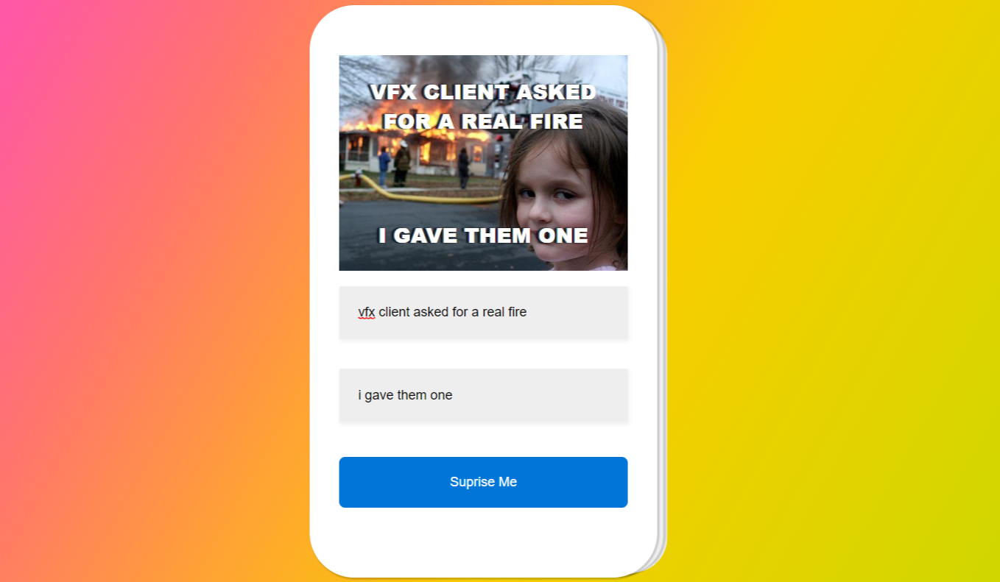

# Netlify Link

- https://react-memeapp.netlify.app/

# React MemeMaker

A Simple Meme Maker app that fetches random meme images from an API  and returns your deisre meme text on the image,
New meme image could be easily generated by clicking the suprise me button.

# Steps to Preview Application

## Method 1

<li> Download Entire code
<li> Open project with your favorite code editor [VS code - recommended]
<li> Navigate to terminal
<li> Run npm i or npm install to install required dependencies 
<li> Run npm start

## Method 2 

<li> Download entire code
<li> Simply Host with any of your desired  online cloud service providers 
<li> I recommend [ netlify ]

## Application Not Running

<li> Check if your local machine has Node services
<li> Also check for faulty network connection as Node services requires internet to download the dependencies
<li> still having issues after trying the guide, Feel free to reach out, so we could resolve them together

  
# Technologies Used  
<li> JSX
<li> CSS [ Styling ]
<li> Fontawesome [ Icons]
<li> React JS [ Logic / Functionality / Rendering ]
